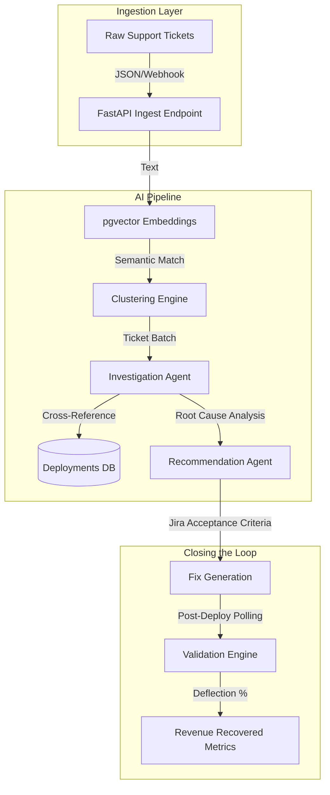

<div align="center">
  
  <h1>FixLoop AI</h1>
  <p><strong>From Customer Pain to Verified Product Fixes.</strong></p>
  <p>Autonomous root-cause intelligence, deployment correlation, and closed-loop validation for Enterprise SaaS.</p>
</div>

---

## 🛑 The Problem
In modern Enterprise SaaS, customer support and engineering operate in silos:
- Support teams drown in duplicate tickets and spend hours manually tagging issues.
- Engineers lack visibility into which bugs cause the most revenue risk and customer churn.
- Product managers struggle to justify engineering effort without hard deflection metrics.

## ⚠️ Why Existing Tools Fail
Existing solutions like Zendesk or Jira focus purely on *workflow management*. They tell you a ticket exists, but they **fail** to explain *why* it exists, *when* the bug was introduced, or *how much revenue* it's burning. 

## 💡 Solution Overview
**FixLoop AI** is a complete, autonomous Product Intelligence Platform. It bridges the gap between Support and Engineering by using multi-agent LLM pipelines to ingest raw support tickets, cluster them semantically, trace them back to specific Git deployments, investigate the root cause, generate Jira-ready engineering fixes, and continuously measure the recovered revenue after a fix is shipped.

---

## 🏛️ Architecture Diagram



---

## 🧠 The AI Pipeline
FixLoop is powered by a multi-agent backend written in Python (FastAPI):
1. **Semantic Clustering Agent**: Ingests unstructured tickets, generates embeddings, and groups duplicates using `pgvector` to identify widespread customer pain points.
2. **Investigation Agent**: Autonomously cross-references a cluster against recent deployments, system logs, and user metadata to pinpoint the exact root cause and model confidence scores.
3. **Recommendation Agent**: Translates the technical root cause into actionable, Jira-ready Acceptance Criteria with estimated engineering effort.
4. **Validation Engine**: Continuously polls ticket volume after a fix is shipped to calculate absolute deflection percentages and recovered monthly recurring revenue (MRR).

---

## ✨ Features
- **Live Ticket Dashboard**: Real-time view into open clusters and revenue at risk.
- **AI Command Center**: An interactive Copilot that explains the "Reasoning Chain" behind every root cause.
- **Simulation Forecasts**: Predicts the exact ticket deflection and revenue recovery *before* engineering starts coding.
- **Resolution Center**: Tracks fixes from proposal to verified loop-closure.
- **Strict Type Safety**: End-to-end type safety from Postgres → Python Pydantic → React Query schemas.

---

## 📸 Screenshots

*(Replace placeholders with actual UI screenshots)*

| Dashboard | AI Command Center | Resolution Center |
|-----------|------------------|-------------------|
|  |  |  |

---

## 🛠️ Tech Stack

**Frontend**
- **React 18** (Vite)
- **TanStack Router & Query** (Type-safe routing and state caching)
- **Tailwind CSS** (Custom glassmorphism design system)
- **Lucide React** (Icons)

**Backend**
- **Python 3.11+ & FastAPI** (Async, high-performance API)
- **Pydantic** (Strict data validation)
- **Structlog** (Structured logging)

**Database & AI**
- **Supabase** (Managed Postgres)
- **pgvector** (Semantic embeddings)
- **OpenAI API** (Reasoning, Clustering, Recommendation)

---

## 🚀 Setup Guide

### 1. Prerequisites
- Node.js (v18+)
- Python 3.11+
- Supabase CLI
- OpenAI API Key

### 2. Database & Backend
```bash
# Start local Supabase instance (includes Postgres + pgvector)
npx supabase start

# Navigate to backend
cd ai-service

# Create virtual environment and install dependencies
python -m venv venv
source venv/bin/activate  # Or `venv\Scripts\activate` on Windows
pip install -r requirements.txt

# Configure environment
cp .env.example .env
# Edit .env and add your OPENAI_API_KEY and local Supabase credentials

# Run the FastAPI server
uvicorn main:app --reload --port 8000
```

### 3. Frontend
```bash
# From the project root
npm install

# Start the Vite development server
npm run dev
```

### 4. Seed the Database
We provide a realistic Enterprise SaaS dataset with 5000 support tickets.
```bash
# Seed via the Supabase CLI
npx supabase db reset
```

---

## 🎥 Demo Flow (For Judges)
1. **The Dashboard**: Start here to see the total revenue at risk and open ticket clusters.
2. **The Clusters Page**: Show how 5,000 messy tickets were perfectly grouped into 10 semantic buckets by the AI.
3. **AI Command Center**: Select a critical cluster and hit **Generate Fix Recommendation**. Watch the AI correlate the spike to a specific deployment version and forecast the deflection metrics.
4. **Resolution Center**: View the generated Jira ticket draft. Finally, click **Validate Fix** to show how FixLoop closes the loop by measuring actual ticket reduction and recovered revenue.

---

## 🔮 Future Scope
- **Direct Jira/Linear Integration**: 1-click sync to push AI-generated Acceptance Criteria into active engineering sprints.
- **Log Aggregator Connections**: Pull raw Datadog or Sentry stack traces directly into the Investigation Agent's context window.
- **Automated Rollbacks**: If the Validation Engine detects a negative deflection (ticket volume increasing), trigger an automated webhook to revert the causal deployment.

---

<div align="center">
  <p>Built with ❤️ for the Hackathon.</p>
</div>
